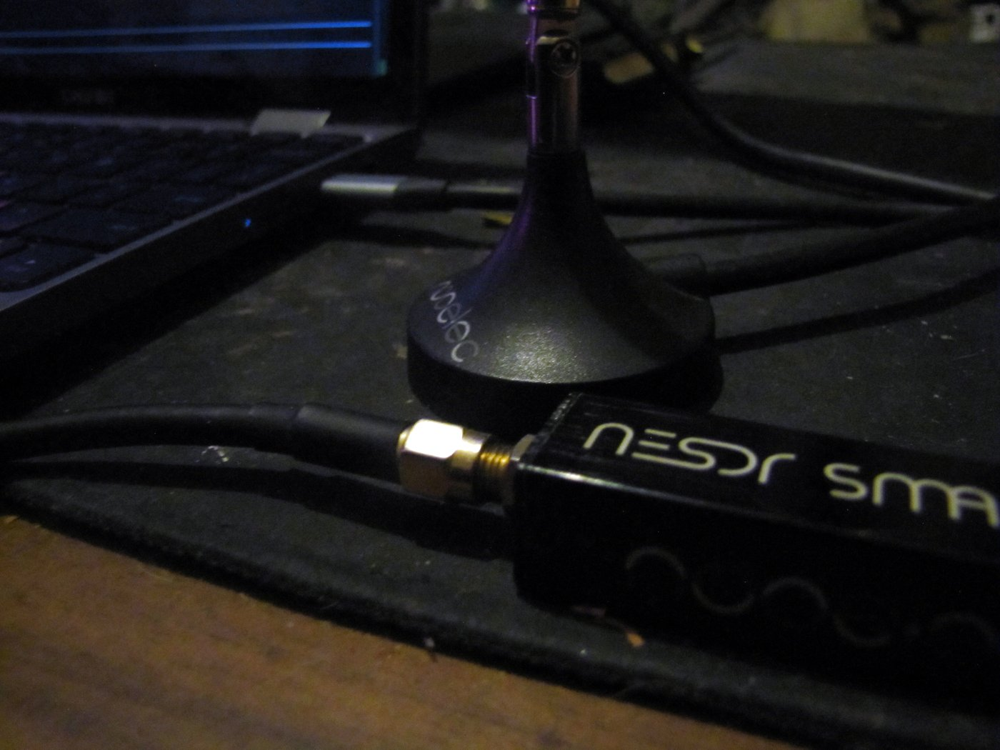

# ADS-B Radar 📡✈️

Terminalowy **radar samolotów w czasie rzeczywistym**. Odbiera transponderowe
sygnały ADS-B na **1090 MHz** taniego dongla RTL-SDR, dekoduje je i rysuje
samoloty jako blipy na radarze ASCII — plus tabelę z lotami (znak wywoławczy,
wysokość, prędkość, odległość).

> ✈️ ADS-B to dane, które samoloty **nadają publicznie** dla bezpieczeństwa ruchu
> lotniczego (to samo źródło, z którego korzysta FlightRadar24). Odbiór jest
> legalnym, popularnym hobby SDR.

<p align="center">
  <br>
  <sub>Cały potrzebny sprzęt: dongiel RTL-SDR (tu Nooelec NESDR SMArt) + antena na 1090 MHz.</sub>
</p>

## Jak wygląda

Radar centrowany na Twojej pozycji, blipy = samoloty (im dalej od środka, tym
dalej od Ciebie), pod spodem lista lotów posortowana po wysokości. Całość w
`rich` — kolorowy, odświeżany na żywo widok w terminalu.

## Wymagania

- **Dongiel RTL-SDR** (RTL2832U) + antena na 1090 MHz
- `rtl_adsb` z pakietu **rtl-sdr** (`sudo apt install rtl-sdr`)
- Python 3 + zależności:

```bash
pip install -r requirements.txt   # pyModeS, rich
```

## Użycie

```bash
# domyślnie centrowane na środek Polski (52.0, 19.0)
python3 adsb_radar.py

# podaj swoją pozycję i promień radaru
python3 adsb_radar.py --lat 50.04 --lon 21.99 --km 150
```

| Flaga | Znaczenie | Domyślnie |
|---|---|---|
| `--lat` | Twoja szerokość geograficzna | 52.0 |
| `--lon` | Twoja długość geograficzna | 19.0 |
| `--km` | Promień radaru w kilometrach | (patrz `--help`) |

Wpisz swoje współrzędne przez flagi — nie musisz ich trzymać w kodzie.

## Jak to działa

1. `rtl_adsb` odbiera i demoduluje ramki ADS-B z 1090 MHz.
2. `pyModeS` dekoduje wiadomości (pozycja, wysokość, prędkość, znak wywoławczy).
3. Pozycje lat/lon są przeliczane na współrzędne siatki radaru względem Twojej pozycji.
4. `rich` rysuje radar + tabelę i odświeża je na żywo.

## Licencja

MIT — dla zabawy i nauki SDR. 🛰️
